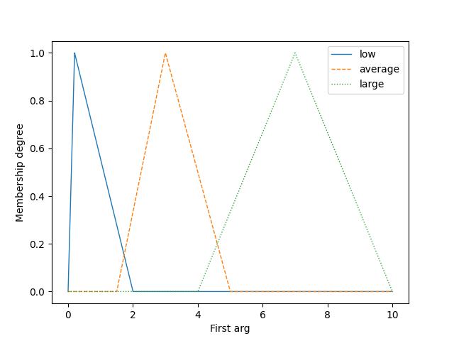
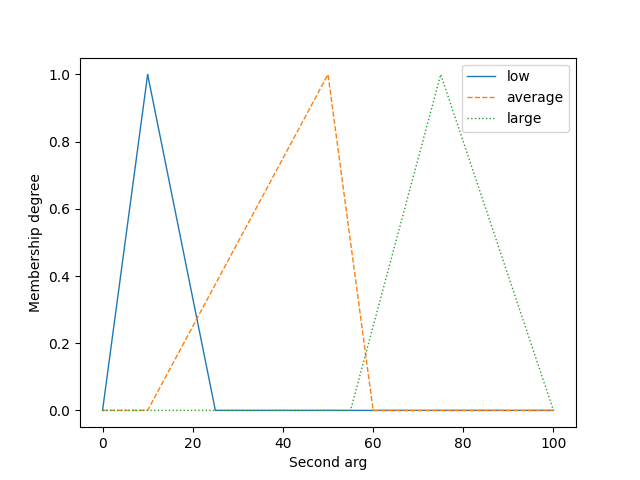
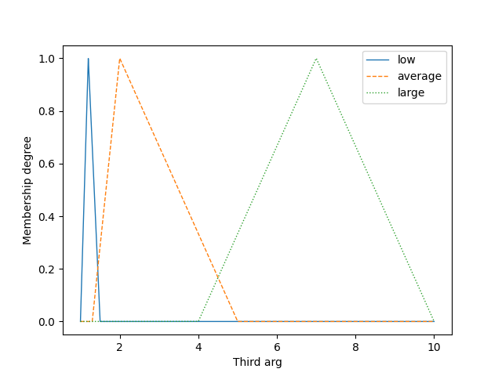

# Lab 2
Heating system for the house. There are two input linguistic variables and one output linguistic variable.
Input variables are temperature_delta - delta from 24° Celcius and humidity (1 - 100 %). Output variable is 
heating_on and shows on how many ° Celcius house should be heated.
Let's show results when temperature_delta varies from 0.0 to 10.0 and humidity from 1 to 100:
```
C:\Users\Roman\PycharmProjects\Unprecise_Modeling\venv\Scripts\python.exe C:/Users/Roman/PycharmProjects/Unprecise_Modeling/main2.py 
  ____  __  _  _  ____  ____  _  _  __   
 / ___)(  )( \/ )(  _ \(  __)/ )( \(  ) v2.11.1 
 \___ \ )( / \/ \ ) __/ ) _) ) \/ (/ (_/\ 
 (____/(__)\_)(_/(__)  (__)  \____/\____/

 Created by Marco S. Nobile (m.s.nobile@tue.nl)
 and Simone Spolaor (simone.spolaor@unimib.it)

Temperature :  0.1  Humidity :  1  result :  3.0934521998042075
Temperature :  0.6  Humidity :  1  result :  3.0934521998042075
Temperature :  1.1  Humidity :  1  result :  3.0934521998042075
Temperature :  1.6  Humidity :  1  result :  3.0934521998042075
Temperature :  2.1  Humidity :  1  result :  3.0934521998042075
Temperature :  2.6  Humidity :  1  result :  3.0934521998042075
Temperature :  3.1  Humidity :  1  result :  3.0934521998042075
Temperature :  3.6  Humidity :  1  result :  3.0934521998042075
Temperature :  4.1  Humidity :  1  result :  4.494695215232828
Temperature :  4.6  Humidity :  1  result :  5.592860069402821
Temperature :  0.1  Humidity :  11  result :  2.88496309781011
Temperature :  0.6  Humidity :  11  result :  2.790573600428896
Temperature :  1.1  Humidity :  11  result :  2.8849630978101097
Temperature :  1.6  Humidity :  11  result :  3.0082819987266785
Temperature :  2.1  Humidity :  11  result :  2.9277882239570587
Temperature :  2.6  Humidity :  11  result :  2.802420698192961
Temperature :  3.1  Humidity :  11  result :  2.763222434510796
Temperature :  3.6  Humidity :  11  result :  2.8122615213304174
Temperature :  4.1  Humidity :  11  result :  3.4230509134805827
Temperature :  4.6  Humidity :  11  result :  5.518810183892112
Temperature :  0.1  Humidity :  21  result :  2.8189531600433018
Temperature :  0.6  Humidity :  21  result :  2.8189531600433018
Temperature :  1.1  Humidity :  21  result :  2.8189531600433018
Temperature :  1.6  Humidity :  21  result :  2.849960806181171
Temperature :  2.1  Humidity :  21  result :  2.8189531600433018
Temperature :  2.6  Humidity :  21  result :  2.8189531600433018
Temperature :  3.1  Humidity :  21  result :  2.8189531600433018
Temperature :  3.6  Humidity :  21  result :  2.8189531600433018
Temperature :  4.1  Humidity :  21  result :  3.5078795897268473
Temperature :  4.6  Humidity :  21  result :  5.3634952669314675
Temperature :  0.1  Humidity :  31  result :  1.2389392494724
Temperature :  0.6  Humidity :  31  result :  1.2385084386649665
Temperature :  1.1  Humidity :  31  result :  1.2389392494723999
Temperature :  1.6  Humidity :  31  result :  1.2447657188823995
Temperature :  2.1  Humidity :  31  result :  1.2408923516502395
Temperature :  2.6  Humidity :  31  result :  1.2385084386649665
Temperature :  3.1  Humidity :  31  result :  1.2385084386649665
Temperature :  3.6  Humidity :  31  result :  1.2385084386649665
Temperature :  4.1  Humidity :  31  result :  4.292962253850908
Temperature :  4.6  Humidity :  31  result :  6.5574886069737985
Temperature :  0.1  Humidity :  41  result :  1.2389392494724
Temperature :  0.6  Humidity :  41  result :  1.234755708980221
Temperature :  1.1  Humidity :  41  result :  1.2389392494723999
Temperature :  1.6  Humidity :  41  result :  1.2447657188823995
Temperature :  2.1  Humidity :  41  result :  1.2408923516502395
Temperature :  2.6  Humidity :  41  result :  1.2352565777941515
Temperature :  3.1  Humidity :  41  result :  1.234755708980221
Temperature :  3.6  Humidity :  41  result :  1.2356964288527026
Temperature :  4.1  Humidity :  41  result :  4.292962253850908
Temperature :  4.6  Humidity :  41  result :  6.5574886069737985
Temperature :  0.1  Humidity :  51  result :  1.2389392494724
Temperature :  0.6  Humidity :  51  result :  1.2347265858594556
Temperature :  1.1  Humidity :  51  result :  1.2389392494723999
Temperature :  1.6  Humidity :  51  result :  1.2447657188823995
Temperature :  2.1  Humidity :  51  result :  1.2408923516502395
Temperature :  2.6  Humidity :  51  result :  1.2352565777941515
Temperature :  3.1  Humidity :  51  result :  1.233674187074856
Temperature :  3.6  Humidity :  51  result :  1.2356964288527026
Temperature :  4.1  Humidity :  51  result :  4.292962253850908
Temperature :  4.6  Humidity :  51  result :  6.5574886069737985
Temperature :  0.1  Humidity :  61  result :  1.2430307873622592
Temperature :  0.6  Humidity :  61  result :  1.2430307873622592
Temperature :  1.1  Humidity :  61  result :  1.2430307873622592
Temperature :  1.6  Humidity :  61  result :  1.2447657188823995
Temperature :  2.1  Humidity :  61  result :  1.2430307873622592
Temperature :  2.6  Humidity :  61  result :  1.2430307873622592
Temperature :  3.1  Humidity :  61  result :  1.2430307873622592
Temperature :  3.6  Humidity :  61  result :  1.2430307873622592
Temperature :  4.1  Humidity :  61  result :  2.182685612719443
Temperature :  4.6  Humidity :  61  result :  2.86417508425535
Temperature :  0.1  Humidity :  71  result :  1.2389392494724
Temperature :  0.6  Humidity :  71  result :  1.2347265858594556
Temperature :  1.1  Humidity :  71  result :  1.2389392494723999
Temperature :  1.6  Humidity :  71  result :  1.2447657188823995
Temperature :  2.1  Humidity :  71  result :  1.2408923516502395
Temperature :  2.6  Humidity :  71  result :  1.2352565777941515
Temperature :  3.1  Humidity :  71  result :  1.2344920001169994
Temperature :  3.6  Humidity :  71  result :  1.2356964288527026
Temperature :  4.1  Humidity :  71  result :  2.028511910105838
Temperature :  4.6  Humidity :  71  result :  2.86417508425535
Temperature :  0.1  Humidity :  81  result :  1.2389392494724
Temperature :  0.6  Humidity :  81  result :  1.2349244877919263
Temperature :  1.1  Humidity :  81  result :  1.2389392494723999
Temperature :  1.6  Humidity :  81  result :  1.2447657188823995
Temperature :  2.1  Humidity :  81  result :  1.2408923516502395
Temperature :  2.6  Humidity :  81  result :  1.2352565777941515
Temperature :  3.1  Humidity :  81  result :  1.2349244877919263
Temperature :  3.6  Humidity :  81  result :  1.2356964288527026
Temperature :  4.1  Humidity :  81  result :  2.028511910105838
Temperature :  4.6  Humidity :  81  result :  2.86417508425535
Temperature :  0.1  Humidity :  91  result :  1.2416852009496744
Temperature :  0.6  Humidity :  91  result :  1.2416852009496744
Temperature :  1.1  Humidity :  91  result :  1.2416852009496744
Temperature :  1.6  Humidity :  91  result :  1.2447657188823995
Temperature :  2.1  Humidity :  91  result :  1.2416852009496744
Temperature :  2.6  Humidity :  91  result :  1.2416852009496744
Temperature :  3.1  Humidity :  91  result :  1.2416852009496744
Temperature :  3.6  Humidity :  91  result :  1.2416852009496744
Temperature :  4.1  Humidity :  91  result :  2.1098937738951884
Temperature :  4.6  Humidity :  91  result :  2.86417508425535

Process finished with exit code 0
```
Temperature delta linguistic variable plot:


Humidity linguistic variable plot:


Heating_on linguistic variable plot:
